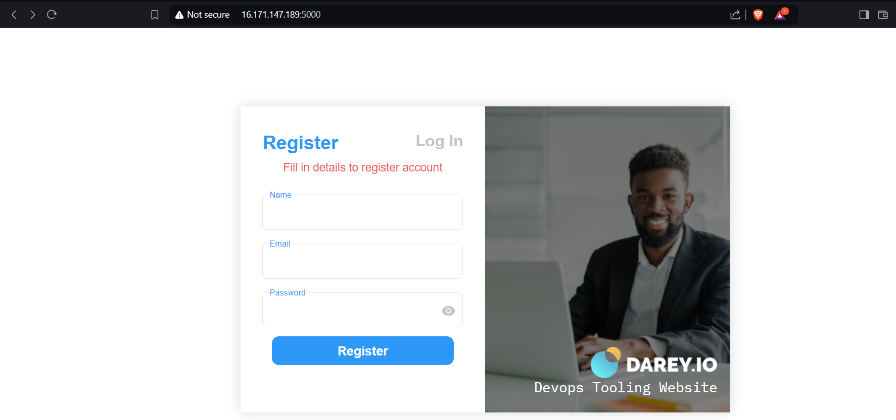
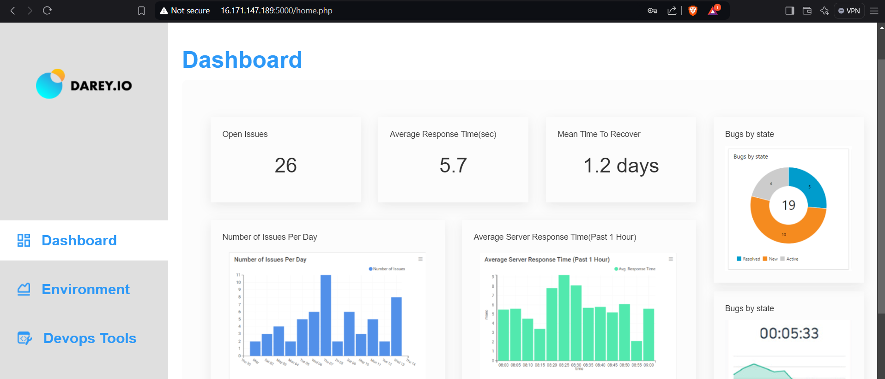

## DOCKERIZING A PHP 2-TIER WEB APPLICATION

This is a web application that we use in my organization to manage and organize or DevOps tools.

We manually built this project in the this documention [here](https://github.com/nbomasi/php-app-aws-IaaS/blob/main/README.md)

But at this point there is a need for us to contenerize our application using docker engine, we actually want to take the advantages of

docker to my organization.

We built this project using docker-compose to make networking seamless, and it is done using 2 aproaches:

1. Cloning down the file to my local server and then copy the file during built. The app Dockerfile is [here](Dockerfile)
2. Cloning the source code at docker built time. The app Dockerfile is [here](app/Dockerfile)

In each case the MYSQL container was ran using MYSQL public image on dockerhub. Take note that the variables are located in .env file

**NOTE:** For best practice, the .env file should not be push to the public repository, but I pushed it there for learning purpose.

This means you MUST edit it to suite your environment.

The docker-compose file is [here](docker-compose.yaml)

Which ever method that suite your environment, to run container, use the following command while in the project directory,
and ensure that the docker-compose.yaml will is located directly in the project directory.

```markdown
docker compose up -d

```

Please find the web page below: 




